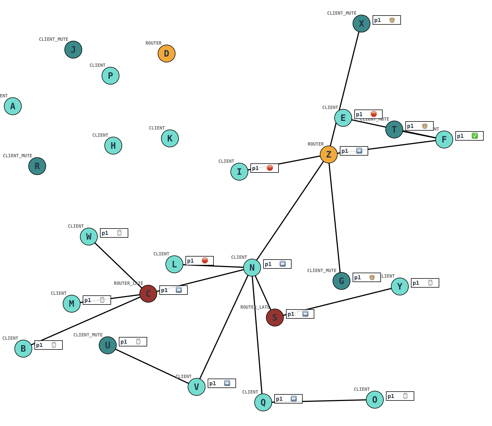

# Meshtastic “managed flooding” simulator

[k2xap.radio/meshtastic/managed-flooding](https://k2xap.radio/meshtastic/managed-flooding)

This is a simplified simulation of the “[managed flooding](https://meshtastic.org/docs/overview/mesh-algo/#broadcasts-using-managed-flooding)” algorithm used by [Meshtastic](https://meshtastic.org). The goal is to provide a demonstration of the key aspects of the algorithm without needing to run a [Docker container](https://meshtastic.org/docs/software/meshtasticator/).

## Usage

See a deployed version [here](https://k2xap.radio/meshtastic/managed-flooding).

The nodes are arranged with a predetermined layout at start time. Click on a node to originate a packet from it. It will broadcast and be heard by nearby nodes. `CLIENT` nodes will start their SNR-based countdowns before relaying, obeying the cancellation and hop limit logic of the algorithm. `ROUTER` and `ROUTER_LATE` nodes will relay either immediately or after all clients. `CLIENT_MUTE` nodes will not relay.

- H: see a complete propagation
- J: see poorly placed `ROUTER` D stop propagation
- G: see `ROUTER_LATE` continue propagation
- F: see hop exhaustion
- X: see `ROUTER`, `ROUTER_LATE` work properly

**Note:** this simulator currently does not include airtime and collision detection, or the effects of such interference. It also does not include the frictionless hop behavior between mutually favorited infrastructure nodes, or the semi-router behavior of `CLIENT_BASE`.

### Running locally

The project is a single-page [React](https://react.dev) app, written in [Typescript](https://www.typescriptlang.org) and built using [Vite](https://vite.dev). The built version is a single HTML file you can save locally, but to run the dev version, make sure you have a current version of [Node](https://nodejs.org) (v24+).

Install dependencies:

- `npm install`

Start the dev server:

- `npm run dev`

Use a browser to visit the displayed address in the console to see the running app.

### Build for deployment

Build a single-file version for deployment:

- `npm run build`

This produces an `index.html` file inside `dist/` that contains everything needed to run the app in the browser.
